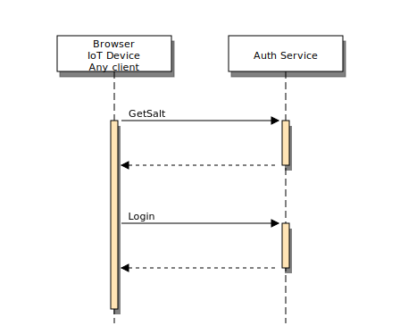

## Giriş

Türkiye'de hizmet veren bir kuruluşsunuz ve regülasyonlar gereği hizmetlerinizi Türkiye'de bulunan veri merkezlerinde barındırmak durumundasınız. Yaygın kullanıcılara hizmet sunuyorsunuz. Kullanıcılar üye oluyor ve giriş yaparak hizmetlerinizden faydalanıyorlar. Regülasyonlar ise verilerin Türkiye'de bulunması gerektiği nedeniyle kimlik doğrulama gibi bazı hizmetlerin yerinde sağlanması gerektiğini ima ediyor. Buna örnek olarak finansal hizmetler sektörünü gösterebiliriz.

## Kimlik doğrulama

Eğer global bir bulut sağlayıcı kullanma imkanımız olsaydı, AWS, Azure ya da GCP üzerinde kimlik doğrulama gerçekleştirirken platformun kendi kimlik doğrulama yöntemlerini kullanarak bu sorumluluğu üzerimizden atmış olurduk. AWS'de Cognito, GCP'de Firebase auth, ya da güvendiğiniz Auth0 ile veya herhangi bir 3. parti kimlik doğrulayıcı ile [OpenID](#Cloud bootstrap:2023-08-18 - auth system:OpenID) standardına uyumlu bir şekilde entegre olarak kimlik doğrulama yapmak mümkündür. Tabi bu durum global bir bulut sağlayıcı kullanmasak da mümkün, fakat regülasyonlar nedeniyle otorizasyon yetkisini yabancı bir veri merkezinde barındırılan kimlik doğrulama verisiyle yapabileceğimizi pek sanmıyorum.

Eğer yazının başından buraya kadar gelebildiysek, kendi kimlik doğrulama çözümümüzü kendimiz deploy edeceğiz demektir. Oysa biz bir güvenlik uzmanı değiliz, ayrıca bütçemiz kısıtlı, on-premise bazı çözümler için onbinlerce dolar ödeyemeyiz, HSM bile alamıyoruz zaten gibi kısıtlarımız mevcut olabilir. Böyle bir kısıtlama yoksa zaten beklenen, kapsamlı bir ISO 27001 almanız ve kimlik doğrulama konularının risk yönetimini doğru yapmanızdır. Fakat bunun için bile zamanı ve bütçesi olmayan bir startup olabilirsiniz. Belki henüz SMS ile kod gönderme hizmetiniz bile bulunmuyor. Bu durumda ne yapabilirsiniz?

## Ne yapabiliriz?

Ne yapabileceğimiz, sorunu nasıl tespit ve teşhis ettiğimizle ilişkilidir. Birinci ve en temel problem, kimlik doğrulama için hala kullanıcı adı ve parola kullanılıyor olmasıdır. Parolalar çoğu zaman düz metin olarak iletilmekte. SSL ile şifreleme yapılsa bile SSL sizi SSL'in sonlandırıldığı yere kadar koruyacaktır. SSL'in sonlandırıldığı yer günümüzde çoğu zaman Cloudflare, ya da load balancer cihazınızdır. Dolayısıyla network hizmet sağlayıcıları veya kurumunuzdaki ağ yöneticileri, açık trafiği izleme imkanı elde edebilir ve bu risk doğurur. Beklenen, uçtan uca şifreli iletişimin uygulama sunucusuna kadar ulaşması ancak bunun başka türlü sorunları var. Uygulama sunucunuzun ağ trafiğinin izlenmesi geçerli bir nedenle gerekir. Bu neden, saldırı ve veri sızıntısı olmadığının izlenmesidir. Dolayısıyla izlenen bir trafikte açık bir password bilgisinin geçmemesi çok önemli. Belki de bu tip bir izleme an itibariyle risk oluşturmuyor olabilir fakat sorun olabilecek unsurların kaynağında ortadan kaldırılması her zaman için en iyisidir. Bir inşaat yaptığınızı düşünün, duvarda, sıvada, yalıtımda bir sorun varsa bunu boyacının aklına gelecek çözüm yöntemleriyle kalıcı olarak düzeltmek mümkün olmaz.

Kimlik doğrulama ihtiyacını 3rd parti kimlik doğrulama hizmeti kullanmadan fakat yine de güvenli olarak çözebilir miyiz? Fakat kalıcı olarak Küresel ölçekte yaygınlığı olan bazı e-ticaret sitelerinde bile kullanıcı adı ve parola bilgisinin açık olarak gönderildiğini görüyoruz.

Oysa zaman zaman veri sızıntılarının gerçekleştiğini görüyoruz. Şu ya da bu nedenle, yazılım geliştiricinin kontrolü olmayan noktalarda, IT yedeklerinden, veritabanının yöneticilerinden, veya bazı 3. partiler kaynaklı olarak veriler, en hassas olan müşteri verileriniz ve müşterinin kimlik doğrulama verileri dahil olmak üzere sızabilmektedir. Bu sızıntılar aşağıdaki yöntemin hangisinin kullanıldığına bağlı olarak farklı etkiler oluşturur:

1. Veritabanına parolayı açık yazmak
2. Veritabanına parolanın SHAxx özetini yazmak
3. Veritabanına parolanın ortak bir anahtar kullanılarak HASHMAC özetini yazmak
4. Veritabanına kullanıcı başına ayrı bir salt kullanarak oluşturulan özeti yazmak

(1) en kötüsü ve doğrudan tüm kullanıcıların erişimi tehlikeye girer

(2) ve (3) arasında bir fark yok çünkü anahtar da sızıyor. Burada çevrimdışı dictionary saldırısı yapılabilir ve tüm kullanıcılar için tek bir saldırı yeterli olur.

(4) bu yöntemler içinde en iyisidir fakat çevrimdışı olarak dictionary attack'e açıktır. Muhtemelen salt veriniz de sızacaktır. Yani yeterince uzun bir zaman boyunca deneyerek her kullanıcı için ayrı ayrı çözmeye çalışabilir.

Dolayısıyla, önüne geçemeyeceğimiz bir veri sızıntısı olduğunda, ciddi bir sorunla karşı karşıya kalırız. Bizim amacımız bu durumda en azından kimlik doğrulama ile ilgili bir sorun yaşamayacağımızdan emin olmak.

Fakat tüm bu yöntemler yeterli değildir. Çünkü konunun temelden yanlış ele alınmış olması nedeniyle, çözüm tam olarak çözüm olamamaktadır. Burada ihtiyaç duyulan Zero Knowledge kimlik doğrulama protokolüdür.

Yazının bundan sonraki kısmında Zero Knowledge kimlik doğrulama yöntemleri ve ülkemiz şartlarında bundan nasıl faydalanabileceğimizi anlatacağım.

## Zero Knowledge kimlik doğrulama yöntemleri

Bu yöntemlerin temel özelliği, karşı tarafa parola ya da parola özeti paylaşmadan kimlik doğrulama yapabilmek.

WebAuthn vs SRP

Webauthn, daha yeni ve modern olmasına rağmen, TPM ya da U2F cihazı (Yubikey, Feitian vb token) gerektirmektedir. Bu nedenle henüz yaygınlaşmasını tamamlayamadı. Benzer çözümlerden bir diğeri de elektronik imza ile doğrulama. Bu yöntemde her giriş için imzalama gerçekleştirilmektedir, imza içinse akıllı kart ya da mobil imza destekleyen mobil cihaza ihtiyaç duyulduğundan dolayı, genel senaryoyu karşılayacak nitelikte değildir. Diğer alternatif ise TC kimlik kartı ve KDHS yöntemidir. KDHS yöntemiyle kimlik doğrulama yaşam döngüsü, bildiğimiz basit kimlik doğrulamaya göre nispeten karmaşıktır. Aslında yapılması gereken, TC kimlik kartlarıyla basit bir doğrulama yöntemi geliştirmek olmalıdır fakat henüz bunun yaygınlaşmadığını görüyoruz. Kullanıcının farklı cihaz ve tarayıcılardan, yardımcı bir cihaz olmaksızın kimlik doğrulaması henüz mümkün değildir. Bazı IoT cihazları gibi, çok düşük kaynağa sahip ortamların kimlik doğrulaması için ek donanım kullanmak maliyetli olabilir.

Tüm bu nedenlerle, hala parola bazlı korumaya ihtiyaç duymaktayız. Dip toplamda bir parola koruması söz konusudur. O zaman bu yöntemin zayıflıklarını ortadan kaldırmaya çalışmak ya da bu zayıflıklara sahip olmayan bir alternatif geliştirmek gerekir.

Bu konuda değerlendirilebilecek alternatifler PAKE protokolleri olup, SRP (Secure Remote Password) protokolü yaygın implementasyonlardan biridir. Yazının devamında SRP'ye odaklanacağız.

## SRP (Secure Remote Password)

SRP ile kullanıcı kaydı

- Kaydolurken parola, parola özeti v.b. karşı tarafla paylaşılmaz
- Kullanıcı bir parola girer ve bunu sadece kendisi bilir
- Kayıt sürecinde bir doğrulama verisi oluşturulur. Bu doğrulama verisi her kullanıcı için özeldir ve bir özet v.b. değildir, kullanıcının parolasının doğrulama yöntemi bilgisini içerir.
- Doğrulama verisini kullanıcı oluşturur ve sunucuya gönderir.
- Güvenli olmayan ortamlarda bile kimlik doğrulama yapabilir. Düşmanların protokol üzerinden öğreneceği tek veri parolayı doğru girip girmediğinizdir

SRP ile giriş neden güvenli

- Giriş yaparken parola bilgisi, parolanın özeti v.b. karşı tarafla paylaşılmaz
- Sunucu ele geçirilmiş olsa bile, kullanıcı hakkında bilebileceği tek şey parolasını doğru girip girmediğidir
- Dolayısıyla sunucunun ve kullanıcıya sunulan hizmetin şifrelenmiş kimlik doğrulama verisi saklaması gibi bir durum söz konusu olmayacağından daha az baş ağrısı demektir

SRP kullanmak çok kolaydır

- Birçok dilde SRP implementasyonları mevcut.
- Güncel sürüm SRP 6a olup, farklı implementasyonlar biribiriyle uyumsuz olabilir.
- Test ettiğimiz çalışan kombinasyonları destekliyoruz
  - Backend: Go
  - Front: Javascript

Simplified interface
Proto defined 4 methods

- Register
- GetSalt
- Login
- CompleteLogin

Hatadan kaçınmak için SDK olarak kullanılabilir

Register

Login

SRP'nin en buyuk eleştirisi, karmaşik olduğu. Fakat göründüğü gibi, ufak değişikliklerle SRP akışını kurumunuz icin kolayca uygulanabilir hale getirebilirsiniz.

Unutmayın, bu dönüşümü yapmak kullanıcı parolalarının özetlerinin veritabanında saklanması yerine kullanıcının size beni bununla doğrula dediği bir doğrulayıcının veritabanında saklanması demek, yani parola özetlerinden ve bunun yükümlülüklerinden tamamen kurtulmuş olacaksınız.

Örnek uygulama ve demo için lutfen bizimle iletişime geçin.

## Sonuç

Finansal ekosisteme katkıda bulunurken ve ödeme hizmetleri ve elektronik para kurluşlarının asıl işlerine odaklanmalarına yardımcı olmaya çalışıyoruz. SRP kimlik doğrulama modülünü en uygun maliyetlerle ve güvenle kullanabilirsiniz. Daha fazla bilgi için [iletişime]( "İletişim") geçin.
