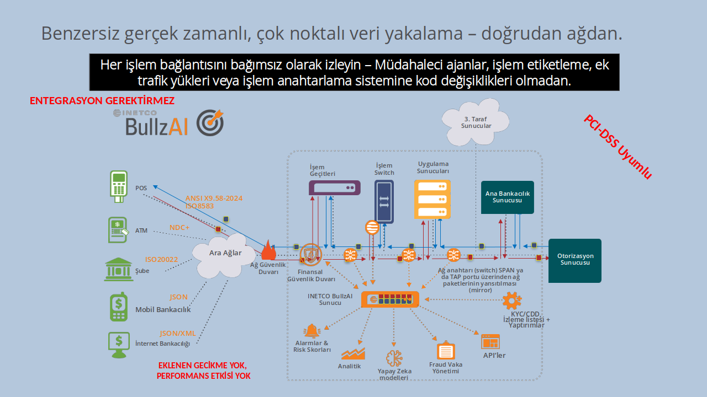
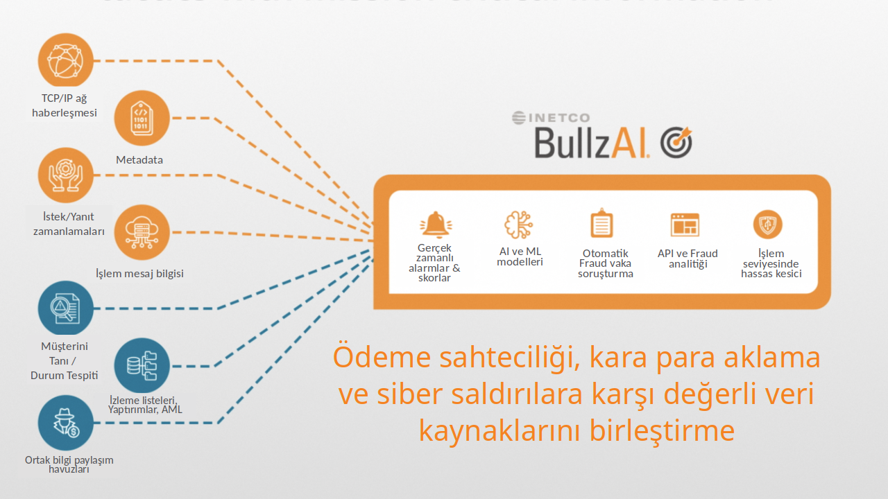

BullzAI, INETCO gerçek zamanlı veri platformundan beslenerek sahte ödeme işlemlerini diğer çözümlerin yakalayamayacağı şekilde yakalar ve engeller. Veriler, sunucular ve switch üzerinde yük oluşturmayacak şekilde ağdan toplanır.

## 360 derece yaklaşım nasıl işliyor

İşleme ilişkin her noktadan gelen verinin birbiriyle ilişkilendirilerek yapıldığı gerçek zamanlı analiz sonucunda yapay zeka tarafından fraud tespit edilmesi durumunda alarm üretilir ya da sadece ilgili işlemler "Finansal Güvenlik Duvarı" tarafından kesilir. Bu yaklaşım INETCO'nun ortaya koyduğu benzersiz bir yaklaşımdır.

AI modeli her kart, müşteri için ayrı ayrı otomatik ve kesinti olmaksızın canlı olarak eğitilir. Yaklaşımın bilimsel olarak açıklanmış bir özelliği olarak, 3-4 işlemin kaydının oluşması, eğitim için yeterli olmaktadır. Dolayısıyla, bu yapıyı ayakta tutmak için gerekli insan kaynağı son derece azdır.

AI modeli ve bütünleşik yaklaşım o derece başarılıdır ki, global olarak birçok uygulamada, ödeme ağındaki farkedilemeyen teknik problemlerin belirlenmesini ve kalıcı olarak çözülmesini sağlayacak bir güç olarak konumlandırılmaktadır. Veri kalitesi forensik denetimlere yönelik gereksinimleri karşılayacak kadar güvenilirdir.

PCI DSS uyumludur. Tüm hassas verilerin işlenmesinde, saklanmasında ve gösteriminde bu uyumluluk sağlanmıştır.

## Neden farklı?

Gerçek zamanlı ödeme sahtekarlığı tespiti, engelleme ve siber güvenlik koruması

- Diğer çözümlerin tespit edemediği sahte ödeme işlemlerini algılar ve engeller.
- Meşru işlemleri engellemeden sıfır gün saldırılarını ve gelişmiş siber saldırıları tespit eder ve engeller.
- Kendi kendine öğrenen makine öğrenimi, yanlış pozitifleri azaltmak için kullanıcı, kuruluş, cihaz ve kart bazında bireysel profiller oluşturur.

Gerçek zamanlı olarak ağ ve uygulama yük bilgilerini yakalayan, çözen, ilişkilendiren ve analiz eden bir sensör ağı kullanır.

- Makine öğrenimi, her etkileşimde bulunan kullanıcı, cihaz ve varlık için benzersiz bir davranış profili oluşturur. Davranışları desen dışına çıktığında, INETCO BullzAI, diğer çözümlerden çok daha hızlı bir şekilde yeni ve ortaya çıkan trendleri yakalayabilir.
- INETCO BullzAI uygulama güvenlik duvarı, IP adresi ve port seviyesinde değil, mesaj seviyesinde otomatik olarak engelleme (veya hız sınırlama) yapabilir. Kötü niyetli trafik engellenir; meşru işlemler engellenmez.
- Kurallara dayalı risk puanlaması ve denetimli ve denetimsiz makine öğrenimi anomali tespiti kullanır.
- BullzAI tarafından yakalanan tüm veriler, her iki risk motoruna yönlendirilir. Risk puanları 10'larca milisaniye içinde döndürülür – genellikle işlem, Yetkilendirme Sunucusuna ulaşmadan önce.

- INETCO BullzAI, tüm uçtan uca ağ ve uygulama işlem verilerini korelasyonlar ve gerçek zamanlı olarak uçtan uca işlemler için tek bir görünüm oluşturur – ağ ACK'leri ve zamanlamalar dahil.
- Her işlemi, istemciden yetkilendirme sunucusuna ve geri istemciye kadar (ve aradaki tüm noktalar) bağlantı, hizmet, uygulama ve iş seviyesi perspektiflerinden birleştirir ve görüntüler.

<!-- <iframe width="100%" target="_top" height="400px" src="/slides/finance-fraud-360"></iframe> -->

BullzAI lansman videosunu izleyin.



Ürün broşürünü görüntüleyebilirsiniz.



PCI DSS uyum beyanını görüntüleyebilirsiniz.


