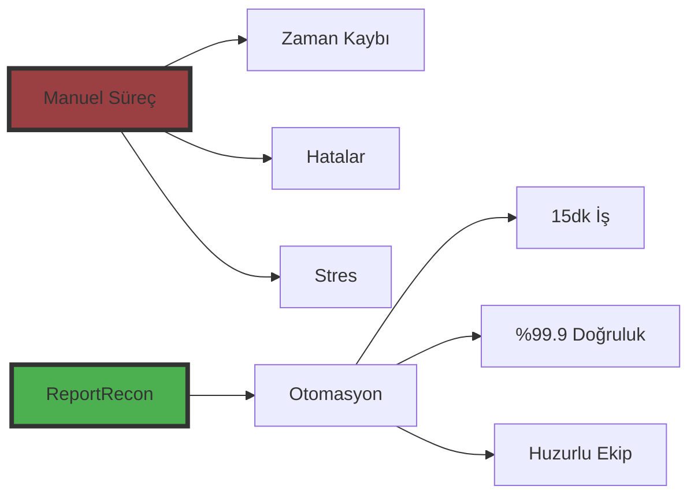



# ReportRecon

## Profesyonel Resmi Raporlama Çözümü

_Raporlama süreçlerinizde mükemmel uyum_

---

# Kurumsal Raporlama İhtiyacı

- Regülasyona tabi kuruluşlar için zorunlu raporlamalar
- Düzenleyici kurumlarla günlük veri paylaşımı
- Kapsamlı içerik doğrulama gereksinimleri

---

# Raporlama Süreçlerinde Hassasiyet

- Veri hazırlama sürecinde yüksek dikkat ihtiyacı <!-- .element: class="fragment fade-up" -->
- Detaylı kontrol gereksinimleri <!-- .element: class="fragment fade-up" -->
- Kurum validasyonlarına tam uyumluluk zorunluluğu <!-- .element: class="fragment fade-up" -->

---

# Uyumsuzluk Riskleri

- Standart dışı veri formatları
- Manuel kontrol süreçlerinin yarattığı iş yükü
- SFTP aktarımlarında yaşanan zorluklar

---



# Manuel Süreçlerin Zorlukları


- Günlük SFTP kontrolleri 
- Hata düzeltme süreçleri 
- Düzeltilen kayıtların takibi 
- Müşteri süreçlerinde olası aksamalar 


---

# Veri Saklama Gereksinimleri

- 10 yıllık yasal saklama süresi
- Mali denetim gereksinimleri
- Kolay erişilebilir arşivleme ihtiyacı
- İtiraz süreçleri için kanıt niteliği

---



# Veri İzleme Gereksinimleri

- Otomatik durum (status) takibi
- Hatalı kayıtların tespiti
- Kaynakta düzeltme imkanı
- Düzeltme kayıtlarının yönetimi

---



# Neden Otomasyon Gerekli?

- Çift yönlü veri akışı
- Sürekli güncelleme ihtiyacı
- Manuel süreçlerin yetersizliği
- Operasyonel verimlilik

---

---



# ReportRecon Çözümü

✓ Günlük otomatik rapor oluşturma

✓ Validasyon kontrolleri

✓ Web tabanlı önizleme

✓ Otomatik SFTP entegrasyonu

---

# ReportRecon Avantajları

✓ Durum izleme ve bildirimler

✓ E-posta uyarı sistemi

✓ Finansal denetim uyumluluğu

✓ KVKK uyumlu altyapı

✓ Yüksek güvenlik standartları

---



# Hızlı Kurulum

- Mevcut sistemlerle kolay entegrasyon
- Minimum IT desteği
- Hızlı devreye alma
- Uzman destek ekibi

---

# Harekete Geçin!

BTRANS ve benzeri raporlama ihtiyaçlarınız için:

- Profesyonel çözüm
- Uzman destek
- Kolay yönetim

_Detaylı bilgi için bizimle iletişime geçin_

[İletişim formu](/contact)

---

## Resmi Raporlama Çözümü

**ReportRecon**

_Resmi raporlama, titizlikle yürütülmesi gereken bir süreçtir._

---

## Resmi rapor hazırlama ihtiyacı

Regülasyona tabi birçok kuruluş,

Her gün çeşitli raporlar hazırlamaktadırlar.

Hazırlanan raporları düzenleyici kurumlarla paylaşmaktadırlar.

#### İçeriklerin doğru ve kurallara uygun olması gerekmektedir

---

## Resmi raporlarda titiz kontrol gereksinimi

Verilerin hazırlanması aşamasında dikkat ve efor gerekmektedir.

Verilerin kontrol edilmesi gerekmektedir.

#### İçeriğin kurallara uygun olması ve kurumun tanımladığı validasyondan geçmesi sağlanmalıdır.

---

### İçeriklerde uyumsuzluk olması durumunda

Verilerin resmi kurumun istediği standartlarda olmaması hatalara sebep olabilmektedir.

Bu süreçlerde ekipler tarafından verilerin kontrolü, elle resmi kurum sunucularına iletmeleri efor gerektirir.

---

### Manuel kontrollerde hatalar olması durumunda

Raporlama ile ilgili çalışan kişilerin gün içerisinde kurum SFTP sunucularında kontrol yapmak ve hata düzeltmeleriyle ilgilenmeleri, düzeltilen kayıtların akıbetini takip etmeleri gerekmektedir.

Gözden kaçan kayıtlar olursa bunların yansıması müşterilerin çeşitli resmi süreçlerini etkileyebilir.

---

### Verilerin saklanmasına dair beklentiler

Resmi kurumlar, raporlanan verilerin saklanmasını, öngörülen 10 yıl boyunca raporlama yapılan kayıtlara erişilebilir olmasını talep edebilmektedirler.

Bazı raporlamaların mali sonuçlar doğurabilmesinden dolayı, itiraz süreçlerinde kanıt olarak saklanabilmesi amacıyla, kayıtların gönderen kuruluş tarafında kolayca takip edilebilecek şekilde tutulması önerilmektedir.

---

### Verilerin saklanmasına dair beklentiler

Raporlanan verilerin işlendiğine dair durum (status) bilgilerinin otomatik olarak işlenerek saklanması, bu değerlere göre eğer hata varsa ilgili verilerin kaynağında düzeltilmesini sağlamak ve hatalı kayıtlarla ilgili düzeltme göndermek gereklidir.

---

## Raporlama otomasyonu

Dolayısıyla raporlama ve takip süreci, çift taraflı veri akışı ve güncelleme gerektiren bir kurgu gerektirmektedir.

Böyle bir kurgu otomasyon olmaksızın çok zorlayıcı olacaktır.

---

**ReportRecon**

**ReportRecon**, aşağıdaki özelliklere sahiptir

- Günlük otomatik rapor oluşturma
- Raporların kurum validasyon kriterlerine uygunluğunun sağlanması
- Raporları web üzerinden önizleme
- Otomatik SFTP sunucusuna yükleme
- Gönderilen raporlara ait akıbeti izleme
- Gönderim sorunları ve akıbetle ilgili e-posta bildirimleri
- Finansal denetim kriterlerine ve KVKK gibi regülasyonlara uygunluk
- Yüksek veri güvenliği

---

## Kurulum ve devreye alma

**ReportRecon**, sunucularınıza kurularak kısa sürede devreye alınabilmektedir.

---

## Hemen Harekete Geçin

BTRANS gibi düzenli resmi raporlama ihtiyacınız varsa, siz de hemen ReportRecon kullanmaya başlayın, raporlama süreçlerinizi uzman desteği ile kolayca kurgulayın ve yönetin.

---

Teklif almak için bilgilerinizi bırakın, sizi arayalım.

- Mail: [info@recon.com.tr](mailto:info@recon.com.tr)
- WhatsApp: [+90 850 309 0 123](https://wa.me/message/Q64CBO6X4W3OC1)
- [İletişim formu](/contact)
